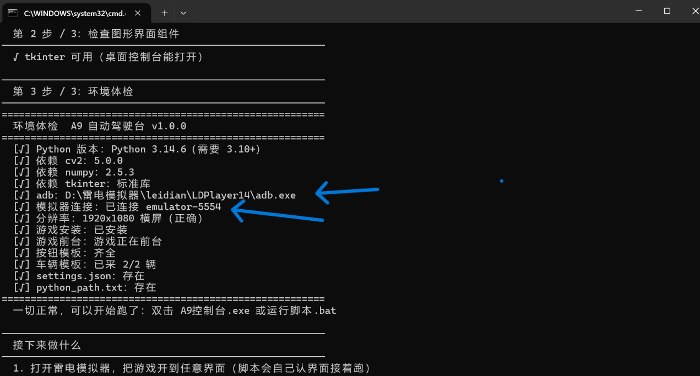
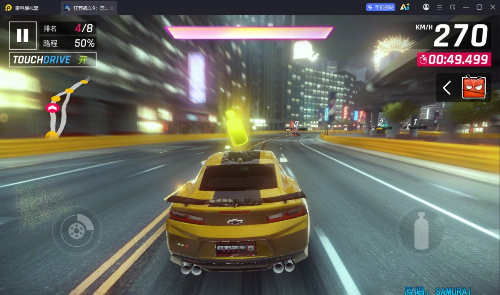
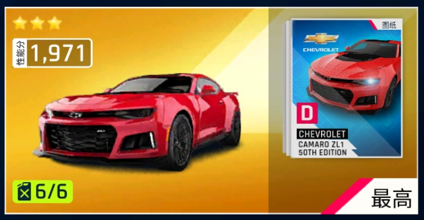
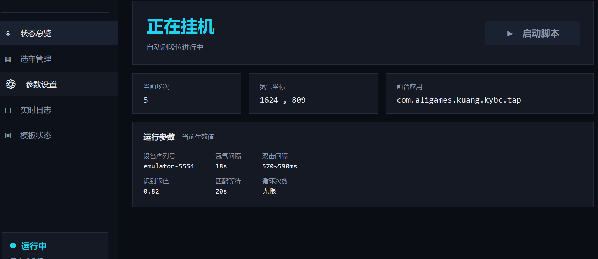
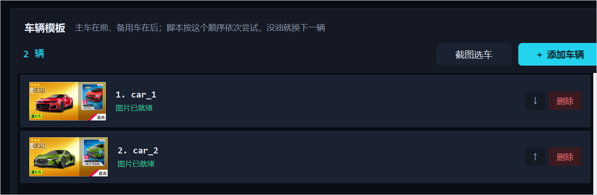

# 狂野飙车9 自动挂机脚本（PC 雷电模拟器）


用 **Python + ADB + OpenCV 模板匹配** 做的《狂野飙车9》PC 模拟器自动挂机脚本，
带一个桌面控制台（Tkinter 写的，**不是网页**）。

当前版本 **v1.0.1**，更新内容见 [CHANGELOG.md](CHANGELOG.md)。

模拟器必须是 **横屏 1920×1080**，窗口不要缩放（脚本用 adb 直接操作屏幕，
和窗口位置无关，但截图内容必须是真实的游戏画面）。

---

## 图文使用教程

> 从下载到跑起来，按这个顺序做就行。想查细节可以看下面的「完整步骤」。

### 一、第一次使用

**先跑一遍环境体检**：第一次使用先双击 `一键配置.bat`。它会把 adb 路径、设备序列号
这些都自动找好，有问题的项会直接把**该填的内容**打出来，你复制到「参数设置 → 设备」
就行。再次点击一键配置查看是否**全部显示 √**。



*图 1　一键配置的运行结果：重点看 `adb` 与「模拟器连接」两行（箭头处）*

接着把环境按下面两步准备好：

1. 将模拟器调至 `1920×1080`
2. 将游戏设置成**自动驾驶**，并且露出氮气按钮



*图 2　比赛界面：左下角 TOUCHDRIVE 显示「开」，右下角是氮气按钮（瓶子图标）*

### 二、选择自己的车

1. 默认卡片应该是金的 `ZL1` 和金的 `DS`，若你想换其他车或自己的 `ZL1` 和 `DS` 未金，
   请用脚本重新选择车辆。
2. 在添加车辆时，**要注意截取到车卡片的框**：

<table>
  <tr>
    <td align="center"><b>有框（√）</b></td>
    <td align="center"><b>无框（×）</b></td>
  </tr>
  <tr>
    <td></td>
    <td></td>
  </tr>
</table>

*图 3　左：带完整边框的车卡（√）　右：边框被截掉的车卡（×）*

3. 跑第一次时需要自己辅助脚本选车，在脚本自动进入选车界面时，请滑动屏幕，
   把自己所选车调至**屏幕中央**。虽然脚本能自动滑动选取，但是效率非常低，也容易报错！

### 三、已知限制

> **需要人工介入的地方**：目前脚本并非完美：在**名人堂奖励**和**通行证奖励**弹出时
> 脚本无法识别，还请自己手动关闭；在**动态奖励**弹出时，若选自动模式只能选择前五张，
> 可以选择手动选择动态奖励。

---

## 界面预览



*状态总览：运行状态、当前场次、氮气坐标，以及当前生效的全部参数*



*选车管理：点「截图选车」直接抓模拟器画面框选加车，点「＋ 添加车辆」选现成图片，
可上下调整尝试顺序、删除*

---

## 功能

```
模式选择界面 → 点『经典系列赛』
      ↓
主界面 → 点『开始』进入选车界面
      ↓
选车（按车辆图片识别，不靠坐标）
      ├─ 有油 → 点『开始』开始匹配
      └─ 没油（按钮变『跳过』）→ 点『返回』换下一台车
      ↓
匹配（期间检测「服务器错误」弹窗，自动点 × 并重新匹配）
      ↓
比赛：自动驾驶（TouchDrive） + 每 18 秒双击一次氮气
      ↓
赛后结算：继续 → 继续 → 错失机会
      ↓
动态奖励（出现「从这组奖励中选一个」时）
      ├─ 自动选第 N 张（N 可在参数设置里调）
      └─ 或弹窗提醒你自己选
      ↓
赛后弹窗：里程碑奖励 / 升段 / 降段（可能同时出现，会依次处理）
      ↓
回到主界面，进入下一场（循环）

全程检测闪退：游戏不在前台就自动重启游戏、重新走流程
```

> **前提：游戏里要开启自动驾驶（TouchDrive）**。脚本不负责转向，只负责氮气和各种按钮。

---

## 亮点：走到哪一屏，就从哪一屏接着跑

脚本启动后**先看一屏**，认出现在停在游戏哪个界面，然后从那儿继续，
所以你手动点到流程中途再启动脚本也能接上。

| 界面 | 靠什么识别 | 本屏置信度 | 其它界面最高 |
|---|---|---|---|
| 模式选择界面（游戏最外层） | `mode_card` | **1.00** | 0.39 |
| 主界面 | `mode_entry` | 0.98 | 0.37 |
| 选车界面 | `car_list` | **1.00** | 0.40 |
| 车辆详情页 | `detail_start` / `detail_skip` | **1.00** | 0.40 |
| 赛后结算界面 | `continue1` / `continue2` / `missed_opportunity` | — | ≤0.53 |
| 动态奖励界面 | `dynamic_reward`（只认左上角标题） | **1.00** | — |
| 奖励 / 段位弹窗 | `milestone` / `rank_up` / `rank_down` | — | ≤0.43 |
| 匹配错误弹窗 | `match_error` | — | ≤0.31 |
| 比赛中 / 加载中 | **认不出来 → 安静等待** | — | — |

认不出界面时（多半就是比赛或加载中）脚本**不点任何坐标**：
认不出就无法确认真的在比赛，乱点可能点到别的按钮上，比不点更糟。
等界面变回认得出的样子，脚本会自动接管。

> 目前唯一不能接管的是「比赛进行中」这一屏。想在比赛中间也能接上
> （继续双击氮气），需要额外提供一张比赛画面的标志图（比如氮气按钮的截图）。

---

## 环境要求

| 项目 | 要求 |
|---|---|
| 系统 | Windows |
| Python | **3.10+**（本机验证于 3.14.6） |
| 依赖 | `opencv-python`、`numpy` |
| 界面 | `tkinter`（Python 标准库自带，不用 pip 装） |
| 模拟器 | 雷电模拟器（其它模拟器也行，能连 adb 即可） |
| 分辨率 | **1920×1080 横屏** |

依赖装了 Python 就能一键装（见下面第 1 步），也可以手动：

```bat
pip install -r requirements.txt
```

---

## 完整步骤

> 新手先看上面的「图文使用教程」，照做就能跑起来。这里是查细节用的完整版，
> 教程里已经讲过的（分辨率、自动驾驶、加车、第一次辅助选车）就不重复了。

### 1. 一键配置做了什么

**双击 `一键配置.bat`**，它会自动做完这些事：

1. 找 Python（`py` 启动器 → PATH → 常见安装位置；会跳过微软商店的假 `python.exe`）
   - **没装 Python** 时：提示并自动打开 python.org 下载页，装好再运行一次即可
2. `pip install -r requirements.txt`（优先走清华镜像，失败自动换官方源）
3. 检查 `tkinter`（桌面控制台要用）
4. **跑一遍环境体检**，逐项列出 ✓ / ! / ×，并给出下一步该干什么

配置完还想再查一遍，随时可以：

```bat
python main.py check
```

体检内容：Python 版本、依赖（cv2/numpy/tkinter）、adb、模拟器连接、
分辨率是不是 1920×1080 横屏、游戏装没装、在不在前台、模板齐不齐。

> **哪些东西脚本没法替你装**：雷电模拟器本身、模拟器里的游戏（要登录账号）、
> 以及**你自己的车卡模板**（每个人的车不一样）。这三样按下面的步骤来。

### 2. 模拟器与游戏

脚本会自己认界面，所以游戏停在**模式选择 / 主界面 / 选车界面 / 车辆详情页 /
赛后结算**哪一屏都行，不用特意摆好再启动。

> **adb 路径和设备序列号一般不用手配**：adb 会自动探测（雷电各版本的常见安装位置 +
> PATH + 环境变量），序列号默认 `emulator-5554`。真不对时，体检会告诉你该填什么，
> 改的地方在 **桌面控制台 → 参数设置 → 设备**（或 `config.py` 的 `ADB_PATH` /
> `DEVICE_SERIAL`）。

### 3. 采集按钮模板（已随仓库提供，一般跳过）

仓库里已经带了一套按钮模板，同版本游戏可以直接用。游戏更新导致识别失败时再重采：

```bat
python main.py capture
```

按提示输入编号，**拖动鼠标框选**按钮区域，回车保存。要点：

- **只框按钮本身，别带背景**，框得越干净匹配越准。
- 同一张截图里可以连续采多个模板；换了界面按 `n` 重新截图再继续。
- 必采：`mode_entry`、`detail_start`、`detail_skip`、`detail_back`、
  `continue1`、`continue2`、`missed_opportunity`、里程碑/升段/降段弹窗及其确认按钮，
  以及界面标志 `car_list`（选车界面左上角「车辆选择」标题）、
  `mode_card`（模式选择界面的「经典系列赛」卡片）。
- 采完可以用 `python main.py test <逻辑名>` 看当前屏幕上匹到哪、置信度多少。

### 4. 采集车辆车卡（必须，每个人的车不一样）

**推荐：在控制台里直接框选**（不用离开界面、不用先去外面截图）

打开桌面控制台（双击 **`启动控制台.bat`**）→ 左侧「选车管理」→ 点右上角 **「截图选车」**（界面见上面的「界面预览」）：

1. 它会抓一张模拟器当前画面，弹窗显示出来
2. 用鼠标拖一个框，把**一张完整车卡**框起来（怎么框才对，见教程里的图 3）
3. 回车保存 —— 自动存成 `templates/car_N.png`、加进车辆列表、并做一次质量体检
   （框太小 / 框到空白 / 框到通用 UI 元素都会提醒你）

> 建议就停在**选车界面**做这一步：框完立刻能看出是不是那辆车。

其他两种方式：

```bat
python main.py capture_car
```

或双击 **`采集车辆.bat`**（独立窗口，和上面效果一样）。
也可以在「选车管理」页点 **「＋ 添加车辆」** 直接选一张现成的图片文件。

车辆列表按文件名顺序轮着用：`car_1` 是主车，`car_2`、`car_3` 是备用车；
列表里可以用 ↑/↓ 调顺序、删除。

### 5. 运行

**双击 `启动控制台.bat`** 打开桌面控制台（推荐）：

- 状态总览：当前进度、日志
- 选车管理：**截图选车**（直接抓模拟器画面框选添加）、选文件添加、调顺序、删除
- 参数设置：氮气坐标/间隔、各种超时、识别阈值（存到 `settings.json`）
- 实时日志 / 模板状态
- 左下角 **❤ 打赏作者 ❤**：点开是作者的话和收款码

打开后点界面上的 **「启动脚本」** 开始挂机。

或者用命令行（双击 `运行脚本.bat`，或）：

```bat
python main.py run
```

`Ctrl+C` 或界面上的停止按钮随时停。默认无限循环，`MAX_LOOPS > 0` 可限制场数。

> 仓库里**不带 exe**：`启动控制台.bat` 就是图形界面的入口，双击即用。
> 想要 exe 启动器（`A9控制台.exe` 等），去 [Releases](../../releases) 下载，两个附件二选一：
>
> - **`A9-script-v1.0.1-full.zip`（开箱即用整合包，推荐）**：源码 + 5 个 exe + 起步说明，
>   解压得到一个文件夹，双击里面的 `一键配置.bat`，再双击 `A9控制台.exe` 就行。
> - `A9-launchers-v1.0.1.zip`：只有 5 个 exe（967 KB），适合已经有源码的人，
>   解压到项目文件夹里（和 `gui.py` 同一层）即可。
>
> 也可以自己双击 `build_launcher.bat` 编译（需要 Windows 自带的 .NET Framework）。

---

## 目录结构

```
a9jb/
├── 一键配置.bat        一键装依赖 + 环境体检（新用户从这里开始）
├── 启动控制台.bat      打开桌面控制台（图形界面入口）
├── A9控制台使用教程.docx  图文使用教程（含截图，只留本地 / 不在仓库里）
├── A9控制台.exe       桌面控制台（可选，由 build_launcher.bat 生成，仓库不带）
├── build_launcher.bat / build_launcher.py   重新编译上面那些 exe 启动器
├── gui.py             桌面控制台（Tkinter）
├── main.py            命令行入口
├── setup_env.py       一键配置的实现（装依赖 + 调体检）
├── doctor.py          环境体检（Python/依赖/adb/模拟器/分辨率/游戏/模板）
├── bot.py             主流程 + 界面识别状态机
├── vision.py          模板匹配
├── adb_helper.py      ADB 操作封装
├── capture_tool.py    模板 / 坐标 / 车卡 采集工具
├── settings_io.py     参数读写（settings.json）
├── config.py          所有默认配置（重点看这里）
├── util.py            日志（带轮转）
├── launcher.cs        exe 启动器源码
├── templates/         模板图（按钮 + 界面标志）
├── assets/            收款码图片（打赏弹窗用）
├── docs/images/       README 里的界面截图
├── tests/             离线单元测试
├── logs/ shots/       运行日志 / 截图（自动生成，不入库）
├── LICENSE            GPL-3.0
└── README.md
```

**不会入库的东西**（见 `.gitignore`）：`logs/`、`shots/`、`settings.json`
（本机 adb 路径与你的调参）、`python_path.txt`、`*.exe`、以及
`templates/car_*.png`（每个人的车不一样，请自己采）。

---

## 配置说明

改 `config.py` 改的是**默认值**；图形界面里改的会写到 `settings.json` 并**覆盖**默认值。

| 参数 | 说明 |
|---|---|
| `ADB_PATH` | adb.exe 路径，自动探测，可用 `settings.json` 覆盖 |
| `DEVICE_SERIAL` | 设备序列号，默认 `emulator-5554` |
| `NITRO_X / NITRO_Y` | 氮气按钮坐标（用 `python main.py coords` 采） |
| `NITRO_INTERVAL_S` | 双击氮气周期，默认 18 秒 |
| `NITRO_GAP_MIN_MS / MAX_MS` | 双击两下的间隔，默认 570–590ms |
| `MATCH_THRESHOLD` | 通用模板匹配阈值，越大越严格 |
| `CAR_MATCH_THRESHOLD` | **车辆**单独用的更严阈值，默认 0.92（原因见下） |
| `CAR_MATCH_MIN_MARGIN` | 车辆防误判差值，默认 0.05 |
| `CAR_SETTLE_*` | 选车界面「等画面静止」的相关参数（原因见下） |
| `CAR_SCROLL_*` | 找不到车时自动翻页找的范围 |
| `REWARD_MODE` | 动态奖励：`auto` 自动选第 N 张 / `manual` 弹窗提醒你选 |
| `REWARD_PICK_INDEX` | 自动模式选第几张（1~5，第 6 张在屏幕外） |
| `MATCHING_DELAY_S` | 点『开始』后固定等多久（匹配耗时） |
| `RACE_TIMEOUT_S` | 单场比赛最长时长 |
| `RELAUNCH_*` | 闪退恢复：重试次数、静默不截图时长等 |
| `ENTRY_SEQUENCE` | 主界面 → 选车界面的点击序列 |
| `MAX_LOOPS` | 0 = 无限循环，>0 = 刷满 N 场停 |

---

## 设计要点（都是踩出来的，改参数前建议先看）

**1. 加载中截图会把游戏压崩**
`adb exec-out screencap` 要在模拟器里做 PNG 编码，很吃 CPU；
游戏正在加载时 CPU 已经很满，再截图会**直接把游戏压崩**（实测每次约 43 秒必崩，
完全不截图则能活 152 秒）。所以这些阶段彻底不截图：
重启游戏后静默 75 秒（`RELAUNCH_QUIET_S`）、比赛开局 20 秒（`RACE_START_QUIET_S`）。

**2. 选车必须等画面静止 —— 这曾经导致「选到别的车」**
进入选车界面后，车辆列表会**横向滑动好几秒**（实测约 570–800 px/s）。
如果在滑动途中取到车辆坐标，等点击真正发出去时（截图 0.5s + 匹配 + adb 往返）
车已经滑走一格 —— 结果点到**相邻的那辆车**（实测：想点 Camaro，点开了它左边那台）。
现在取坐标前会先确认画面完全静止，并连拍两帧确认坐标一致。
判据：320×180 灰度图的平均帧差，**静止 0.3–0.4，滚动中 46.7**，差 100 倍，很好判。

**3. 车辆匹配用更严的阈值（0.92，不是通用的 0.82）**
车卡模板里有一大片「所有车都长一样」的装饰（稀有度底色、右边的图纸海报、
『最高』角标、油量角标）。实测把 A 车的模板拿去匹 B 车的卡也能匹到 0.81–0.83：

| 情况 | 置信度 |
|---|---|
| 目标车在场 | **0.99** |
| 目标车不在场，匹到别的车 | **0.83** |

如果沿用 0.82，一旦目标车不在当前画面，脚本就会把别的车当目标车点下去。

**4. 车卡被屏幕边缘裁掉时匹配不到**
模板是 688px 宽的整车卡，卡片被裁掉一部分就匹不上（置信度掉到 0.4）。
所以脚本支持**自动翻页找车**：当前页找不到就前后各翻几页，找完翻回原位。

**5. 弹窗是后来才加载的**
赛后切回主界面时，主界面会**先**渲染出来，里程碑/段位弹窗是随后才加载的。
一看到主界面就结束会漏掉弹窗，所以要连续确认几次都没有弹窗才算真的结束。

**6. 赛后按钮不按固定顺序点**
改成「看到哪个点哪个」，这样从中间任何一步接着跑都行
（比如你手动点过一次『继续』，脚本停在第 2 个上也能接）。

**7. `.bat` 里一个中文字都不能有（开发注意）**

cmd.exe 用**启动时的代码页**解析整个批处理文件（中文系统是 936），文件里写
`chcp 65001` 也来不及生效 —— UTF-8 的中文会被按 GBK 解码，把后面的字符一起吃掉，
症状是莫名其妙的 `'xxx' is not recognized as an internal or external command`。
另外 `.bat` 必须用 **CRLF** 换行，纯 LF 也会解析出错。
所以本项目约定：**`.bat` 只写 ASCII 命令，所有中文提示交给 Python 打印**
（Python 走 Windows 控制台 API，任何代码页都正常显示）。
`tests/test_bat_files.py` 会检查这两条，改坏了 CI 会红。

**8. 匹配失败后要重新选车，不能直接重试**
匹配失败（服务器错误弹窗）时，游戏会把你**退回选车界面** —— 那里没有详情页的
『开始』按钮。旧代码关掉弹窗后直接去找『开始』，必然失败（日志里那句
「没找到『开始』按钮，无法重新发起匹配」），然后就白等一轮进"比赛"，
实际上什么都没跑。
现在关掉弹窗后会先识别当前界面：还在详情页就点『开始』，
已经退回选车界面就**重新选一次车**再匹配；连续失败 5 次才放弃本场。

**9. 「动态奖励」有两种界面，坐标得取交集**
选奖励的界面实测有两种变体，几何还不一样：

| | 赛后那种 | 活动那种 |
|---|---|---|
| 顶栏 | 可见 | 全屏遮罩 |
| 底部 | 有『确认』按钮 | 只有右上角 × |
| 卡位中心 X | 196 / 542 / 888 / 1234 / 1579 | 261 / 606 / 952 / 1297 / 1643 |
| 卡片纵向 | 457~858 | 423~707 |

所以 `REWARD_CARD_X0 / STEP / Y` 取的是两者的**交集**（227 / 346 / 580），
两种都能点中；识别则只认左上角『动态奖励』标题（两种变体上都是 conf 1.00），
**绝不包含卡面图案**——因为奖励内容每次都换。
`tests/test_bot.py` 用上面这组实测数据盯着这件事，改坏了会红。

---

## 常见问题

**Q：我装的是 4399 / 华为 / 小米 版的狂野飙车9，能用吗？**
能。国服分渠道发行，每个渠道包名不一样（TapTap 版是 `com.aligames.kuang.kybc.tap`）。
**脚本启动时会自己问模拟器装的是哪个版本，自动切换过去，不用你改任何配置**；
环境体检也会把真实包名和该填的值直接打出来。想固定下来再改
`config.py` 的 `GAME_PACKAGE` / `GAME_ACTIVITY`（或参数设置里的同名两项）。

**Q：`adb devices` 里看不到设备？**
先确认模拟器已启动；再确认 `DEVICE_SERIAL` 和实际序列号一致（多开第二个实例一般是 `emulator-5556`）。

**Q：同时开着两个模拟器，体检说「拿不到分辨率 / 没检测到游戏」？**
脚本只会用「设备序列号」指定的那个。要么关掉不用的那个，要么把序列号改对
（体检会告诉你当前实际连着哪几个）。

**Q：识别老是失败 / 误判？**
多半是游戏更新后 UI 变了，用 `python main.py test <逻辑名>` 看置信度，重新采集对应模板。
模板是**跟游戏版本绑定的**。

**Q：选车一直说「本页没有车辆 [car_1]」？**
车卡被滑出当前画面或被屏幕边缘裁掉了，脚本会自动翻页找；如果始终找不到，
说明游戏里这批车不可用（比如这次赛事限制车型），换一辆车重采车卡即可。

**Q：改了 `launcher.cs` 之后？**
只有改 `launcher.cs` 才需要重跑 `build_launcher.bat`；改 `gui.py` / `bot.py` 等
Python 文件是即时生效的，**不用重新编译**。

**Q：任务栏图标不对？**
Windows 图标缓存问题，取消固定再重新固定一次，或者重启资源管理器。

---

## 测试

仓库带一套**离线单元测试**（不需要模拟器、游戏或网络），
盯住最容易出错也最不该被改坏的地方：模板匹配的阈值与防误判逻辑、
配置与 `settings.json` 的一致性。

```bat
python -m unittest discover -s tests -t . -v
```

也可以用 `python -m pytest tests -v`（装了 pytest 的话）。
每次 push / PR 都会在 GitHub Actions 上自动跑一遍。

---

## 免责声明

本项目仅供**个人学习与自动化技术研究**使用。使用脚本挂机可能违反游戏的用户协议，
由此产生的任何后果（包括但不限于账号被封禁）由使用者自行承担。
请勿用于商业用途或大规模批量操作。

---

## 许可

本项目采用 **GNU General Public License v3.0**，全文见 [LICENSE](LICENSE)。

```
Copyright (C) 2026 <bluewhite>

This program is free software: you can redistribute it and/or modify
it under the terms of the GNU General Public License as published by
the Free Software Foundation, either version 3 of the License, or
(at your option) any later version.

This program is distributed in the hope that it will be useful,
but WITHOUT ANY WARRANTY; without even the implied warranty of
MERCHANTABILITY or FITNESS FOR A PARTICULAR PURPOSE.  See the
GNU General Public License for more details.
```

> 
